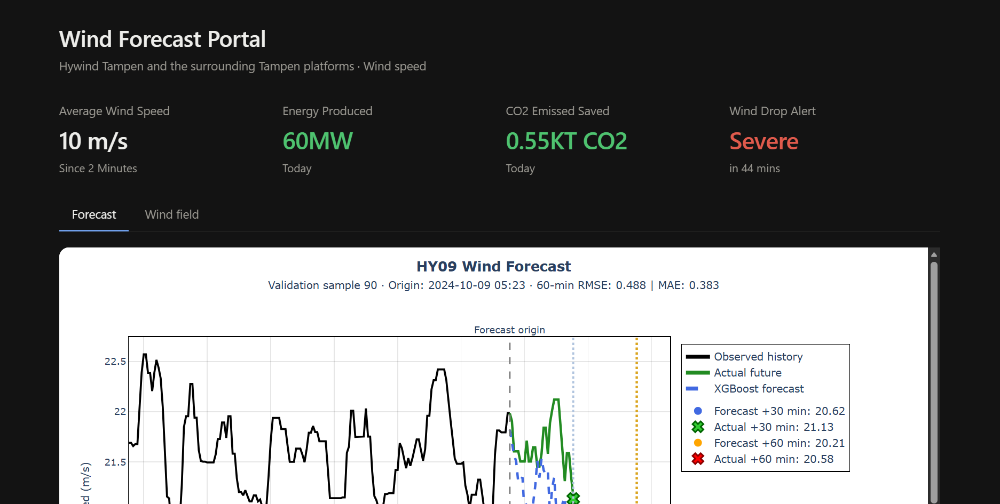
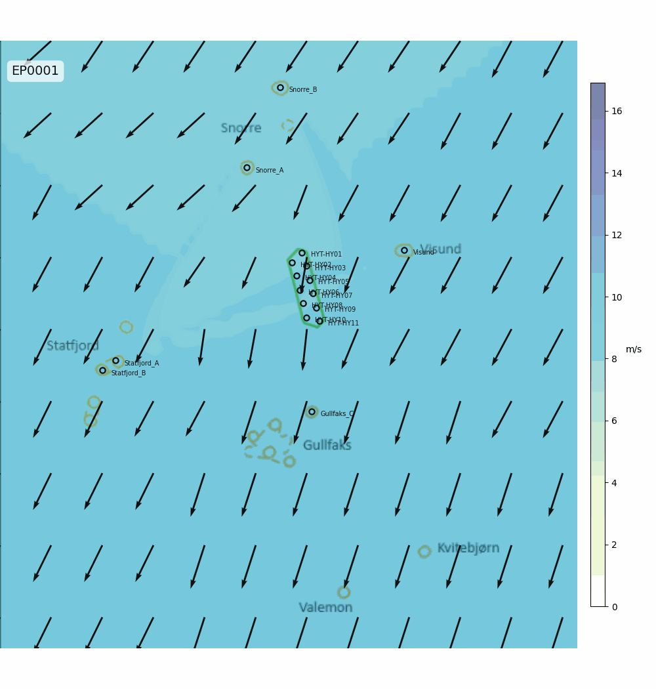
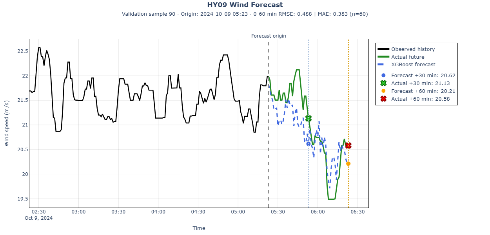
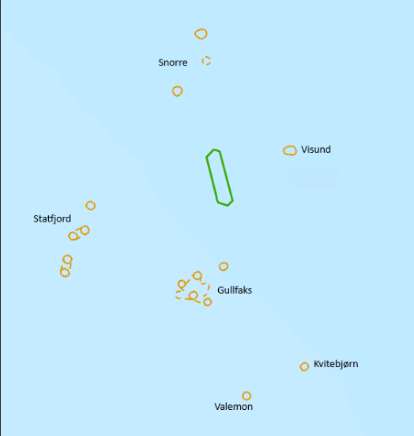
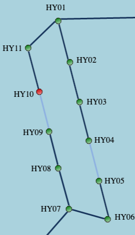
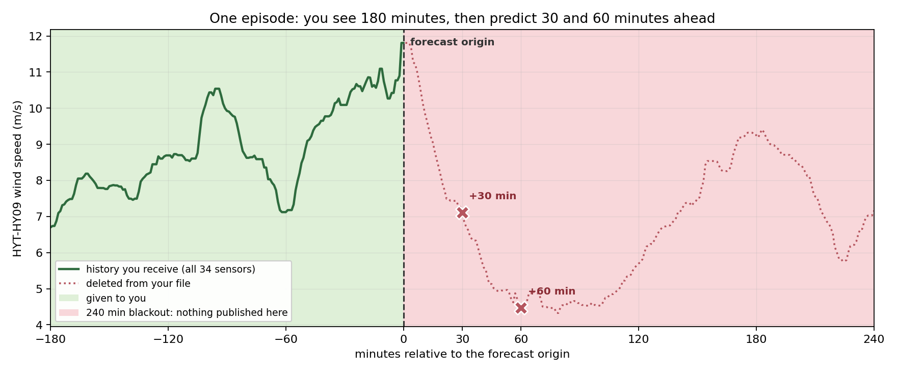

# Equinor Industrial Hackathon — Hywind Tampen Wind Forecast

This repository contains our submission for the Equinor Industrial Hackathon, August 2026, which won the prize for best presentation. The task was to predict short-term wind conditions and provide earlier warning of critical wind-drop events.

## Problem

Hywind Tampen is the world's first large-scale floating offshore wind farm supplying power directly
to offshore oil and gas installations. Wind power reduces emissions and fuel consumption, but rapid
weather changes create operational challenges.

Unexpected drops in wind generation can leave operators little time to react. This may lead to
generator overloads, production disruptions, or emergency operational actions. Traditional weather
forecasts often fail to capture the local, short-term wind changes that matter offshore.

The challenge was to investigate whether measurements from surrounding offshore assets
can improve short-term forecasts and warn operators earlier about critical wind drops at Hywind
Tampen.

## What We Built

A dashboard that displays the predicted wind conditions at Hywind Tampen using time-series
forecasting. It drives a Wind Drop Alarm, which alerts operators when there is a high probability of
a significant decrease in wind availability within the next 30 to 120 minutes. We also built a wind
map that visualises the overall behaviour of the data.

### Wind Map Visualisation

This heat-map visualisation shows the overall behaviour of the wind, based on the training dataset.
Interpolation is used to estimate the wind strength between the measured values from the wind
turbines.

### Prediction Forecast

This graph visualises the forecast wind conditions for one individual turbine (HYT-HY09) over the
next 30 and 60 minutes.

### Files

This repository contains the scripts we created during the hackathon to build the platform. The dashboard can be found within 'hywind-tampen-wind-forecast/wind_forecast_portal.html' file.

## Data

The data used for this project comes from nearby offshore installations and the wind farm itself,
sampled every minute.

### Nearby Offshore Assets

- Statfjord A
- Statfjord B
- Gullfaks C
- Snorre A
- Snorre B
- Visund

### Hywind Tampen Turbines

The dataset covers turbines `HYT-HY01` through `HYT-HY11`.

For each location, wind measurements are represented as:

- **U component:** east–west wind vector
- **V component:** north–south wind vector

Using U and V components avoids circular wind-direction data and allows solutions to focus on
spatial and temporal relationships. The locations can be treated as a network of weather sensors,
where upwind observations may provide advance information about future conditions at the wind farm.

### One Episode

Each episode provides **180 minutes of history** from all 17 locations. The last timestamp of that
history is the **forecast origin**. The task is to predict the HY09 wind speed **30 and 60 minutes
after** it.

*A real wind drop, taken from the training period. The green part is provided. The dotted red part is
removed from the file — including the ten other turbines and the neighbouring platforms. The two
crosses are what is predicted.*

Episodes are at least seven hours apart, so no episode can be used to fill in another.

| File | Period | Purpose |
| --- | --- | --- |
| `data/windfeels_train.parquet` | 2023-01-01 to 2024-12-31 | Training. Contains every asset, including the target `HYT-HY09`. |
| `data/windfeels_test.parquet` | 2025 | The episodes to forecast from. See [The Test Set](#the-test-set). |
| `data/submission_example.csv` | — | The exact rows and columns the submission must contain. |
