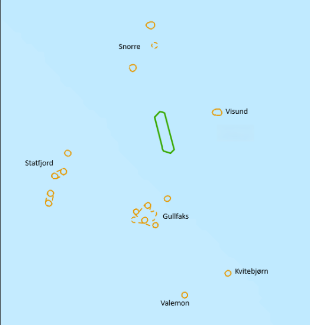
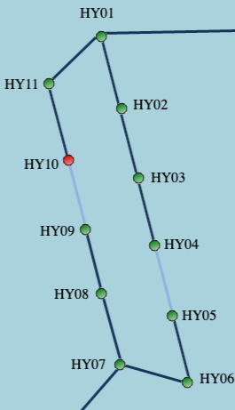
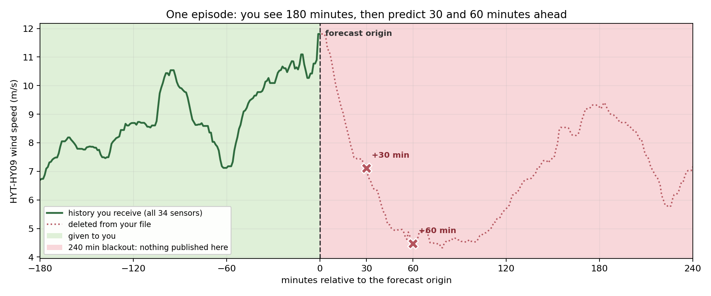

# Hywind Tampen Wind Forecast
Predict short-term wind conditions and provide earlier warning of critical wind-drop events.

## Problem

Hywind Tampen is the world's first large-scale floating offshore wind farm supplying power directly
to offshore oil and gas installations. Wind power reduces emissions and fuel consumption, but rapid
weather changes create operational challenges.

Unexpected drops in wind generation can leave operators little time to react. This may lead to
generator overloads, production disruptions, or emergency operational actions. Traditional weather
forecasts often fail to capture the local, short-term wind changes that matter offshore.

In this problem you will investigate whether measurements from surrounding offshore assets
can improve short-term forecasts and warn operators earlier about critical wind drops at Hywind
Tampen.

## What You Could Build

Develop an AI solution that predicts future wind conditions at Hywind Tampen using observations from
nearby offshore installations and the wind farm itself.

Choose one or more objectives:

- Forecast wind conditions for 1 individual turbine (HYT-HY09) over the next 30 and/or 60 minutes. Evaluation metric: root
  mean squared error (RMSE).
- Estimate forecast uncertainty and confidence intervals for 1 individual turbine (HYT-HY09). Evaluation metric: pinball loss.

Participants may explore machine learning, deep learning, time-series forecasting, agentic workflows,
and explainable AI techniques.

## Bonus Problem

Build an operator-facing dashboard or intelligent early-warning system. A Wind Drop Alarm should
alert operators when there is a high probability of a significant decrease in wind availability
within the next 30 to 120 minutes.

A useful operator experience should communicate forecast horizon, expected severity, uncertainty,
and recommended action without overstating confidence.

## Data

Participants receive a preprocessed time-series dataset sampled every minute.

| File | Period | Purpose |
| --- | --- | --- |
| `data/windfeels_train.parquet` | 2023-01-01 to 2024-12-31 | Training. Contains every asset including the target `HYT-HY09`. |
| `data/windfeels_test.parquet` | 2025 | The episodes you forecast from. See [The Test Set](#the-test-set). |
| `data/submission_example.csv` | - | The exact rows and columns your submission must contain. |

### Nearby Offshore Assets

- Statfjord A
- Statfjord B
- Gullfaks C
- Snorre A
- Snorre B
- Visund

### Hywind Tampen Turbines

The dataset covers turbines `HYT-HY01` through `HYT-HY11`.

For each location, wind measurements are represented as:

- U component: east-west wind vector
- V component: north-south wind vector

Using U and V components avoids circular wind-direction data and allows solutions to focus on spatial
and temporal relationships. The locations can be treated as a network of weather sensors where
upwind observations may provide advance information about future conditions at the wind farm.






## The Test Set

The test data is not one long continuous stretch of 2025. It is a set of **347 short,
separated episodes**.

### One episode

Each episode hands you **180 minutes of history** from all 34 sensors. The last timestamp
of that history is the **forecast origin**. You then predict the HY09 wind speed **30 and
60 minutes after** it.



*A real wind drop, taken from the training period. You receive the green part. The
dotted red part is deleted from your file - including the ten other turbines and the
neighbouring platforms. You predict the two crosses.*

Episodes are at least 7 hours apart, so no episode can be used to fill in another.

Every row in the test file carries an `episode_id`, so you can process them one at a time:

```python
test = pd.read_parquet("data/windfeels_test.parquet")

for episode_id, history in test.groupby("episode_id"):
    forecast_origin = history.index.max()      # 180 rows, ending here
    # predict HY09 speed at forecast_origin + 30 min and + 60 min
```

### Which moments were chosen

Forecasting wind is easy when it is steady and hard when it changes - and changes are exactly
what matters operationally. So episodes are not spread evenly. They are **selected around real
wind events**, with calm periods kept as controls. This test set is deliberately harder than an average slice of 2025.


## Deliverable Considerations

- Report the required metric per submitted forecast column and in aggregate.
- Benchmark against a simple persistence forecast.
- Explain uncertainty calibration and alarm thresholds when applicable.
- Include reproducible setup and run instructions with the solution.

## Evaluate Local Forecasts

Use [evaluate_metrics.py](evaluate_metrics.py) to score a forecast CSV or Parquet file against
a combined ground-truth target file. Both files must contain a `Time` column (or a datetime index)
and matching combined wind-speed columns.

The answers for the test episodes are held back, so score yourself locally by carving a time-based
holdout out of the **training** data. To make it representative, mimic the episode setup: pick
origins in 2024, use the preceding 180 minutes as input, and score only the points 30 and 60 minutes
ahead. Convert your holdout's U and V components into a combined target file with
[combine_wind_components.py](combine_wind_components.py). Local forecasts and official submissions
use the same combined wind-speed format, organizers convert their private U and V targets with the
same script before official scoring.

Create combined local targets, then run the evaluator:

```bash
python combine_wind_components.py --input path/to/val.parquet --output targets.csv
python evaluate_metrics.py --predictions path/to/submission.csv --targets path/to/targets.csv
```

Add `--output metrics.json` to save the metric results to a file. The evaluator matches 
forecasts and targets by Time and skips timestamps where either value is missing.


## Submit Final Forecasts

Your submission must contain **exactly the 694 timestamps** listed in
[data/submission_example.csv](data/submission_example.csv) - two rows per episode. Copy its `Time`
column and replace the values with your forecasts.

Submit one combined wind-speed value for HY09, calculated from the U and V components. The 
target is `sqrt(U**2 + V**2)`. Use the asset name for a point forecast. Point forecasts are
treated as the median (`q=0.5`) and scored with RMSE:

```text
Time,HYT-HY09
2025-01-01T06:50:00Z,12.4
```

The ground-truth target file uses the same `HYT-HY09` combined wind-speed column. For uncertainty
forecasts, append the quantile to the asset name. The evaluator accepts `_q0.05` notation and
reports pinball loss against each named quantile, plus over-estimation percentage and mean
underestimation:

```text
Time,HYT-HY09_q0.05,HYT-HY09_q0.5,HYT-HY09_q0.95
2025-01-01T06:50:00Z,8.1,12.4,16.0
```

Include only the `Time` column and your forecast columns. Do not add `episode_id` or other helper
columns. Timestamps are UTC and must match the example exactly.

Columns are optional - skip the quantiles, or forecast only one horizon, and you are simply scored
on what you sent. Rows are not: keep all 694 and leave a cell empty for anything you chose not to
forecast.

**SUBMISSION**

Send this final target file as a CSV or parquet to `npeti@equinor.com` with your **team name** as the filename 
and subject of the email `AI HACKATHON HYT SUBMISSION` to be placed on the leaderboard. 

**NOTE:** Failing to correctly mention the filename and subject will lead to exclusion and ultimately not be considered as a valid submission. 


